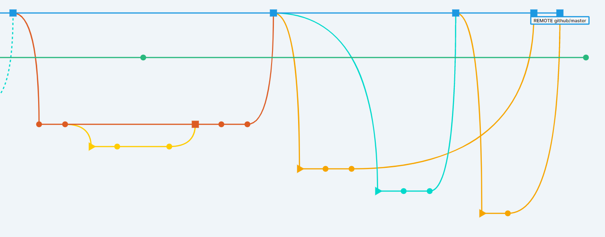

# PlastiGit

A personal fork of [sourcegit-scm/sourcegit](https://github.com/sourcegit-scm/sourcegit), a cross-platform Git GUI client. Licensed under the same [MIT License](LICENSE) as upstream. Not affiliated with or endorsed by the original SourceGit project — for the official app, releases, and documentation, go to the [upstream repository](https://github.com/sourcegit-scm/sourcegit).

## Screenshot



## Features

* **Plastic SCM style visualization** — the commit graph is laid out closer to how Plastic SCM presents history, rather than git's default graph style.
* **Every branch is clearly separated** — branch lanes are visually distinct, making it easy to tell at a glance which commits belong to which branch.
* **Auto-sync** — your local and remote branches are kept in sync automatically as you commit or fetch, instead of requiring a manual push/pull every time.
* **Simplified menus** — git's more obscure/rarely-needed actions are trimmed from the UI, keeping the menus focused on what you actually use.
* **Protected main branch** — direct commits to main branches are disallowed; changes must be merged in from a sub-branch.

## Building

```sh
dotnet nuget add source https://api.nuget.org/v3/index.json -n nuget.org
dotnet restore
dotnet build
dotnet run --project src/SourceGit.csproj
```

Requires the [.NET SDK](https://dotnet.microsoft.com/en-us/download).

## Contributing

This is a personal fork; it doesn't take outside contributions. For general SourceGit improvements or bug fixes, please submit to [the upstream project](https://github.com/sourcegit-scm/sourcegit) instead.
